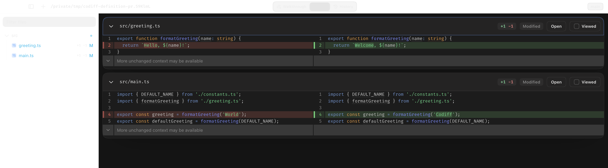
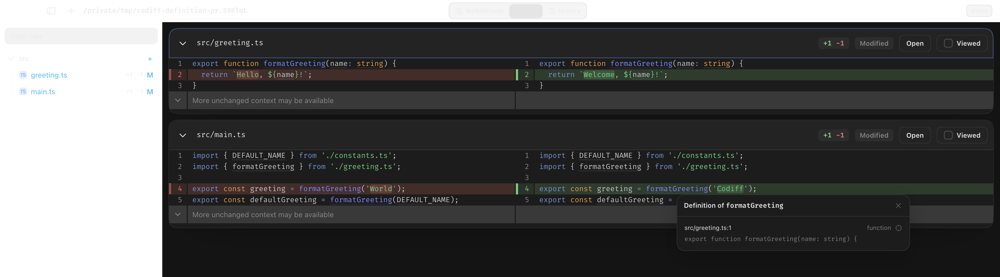

# Definition navigation example

This example creates a temporary, deterministic Git repository with two unstaged TypeScript
changes and opens it in Codiff:

```bash
vpr example:definition-navigation
```

Open `src/main.ts`, then hold Command on macOS or Ctrl on Windows/Linux. Identifier-shaped tokens
should gain a subtle underline while the modifier is held.



- Click `formatGreeting`. Codiff should offer `src/greeting.ts:1`, then jump to it inside the
  current diff because that file is part of the review.
- Click `DEFAULT_NAME`. Codiff should offer `src/constants.ts:1`, then open that location in your
  configured editor because the unchanged source file is not in the diff.



The fixture uses TypeScript to keep the example compact, but navigation is not tied to TypeScript.
The scanner groups compatible file extensions and recognizes conservative declaration shapes for
JavaScript/TypeScript, Python, Go, Rust, Java/Kotlin, C/C++/Objective-C, C#, Ruby, Swift, PHP, and
shell scripts. Each supported language family has regression coverage.

The temporary repository is removed when Codiff exits. Pass `--keep` to preserve it for inspection.

The repository builder is also used by the automated definition-search test, so the manual demo
and regression fixture cannot silently drift apart.
